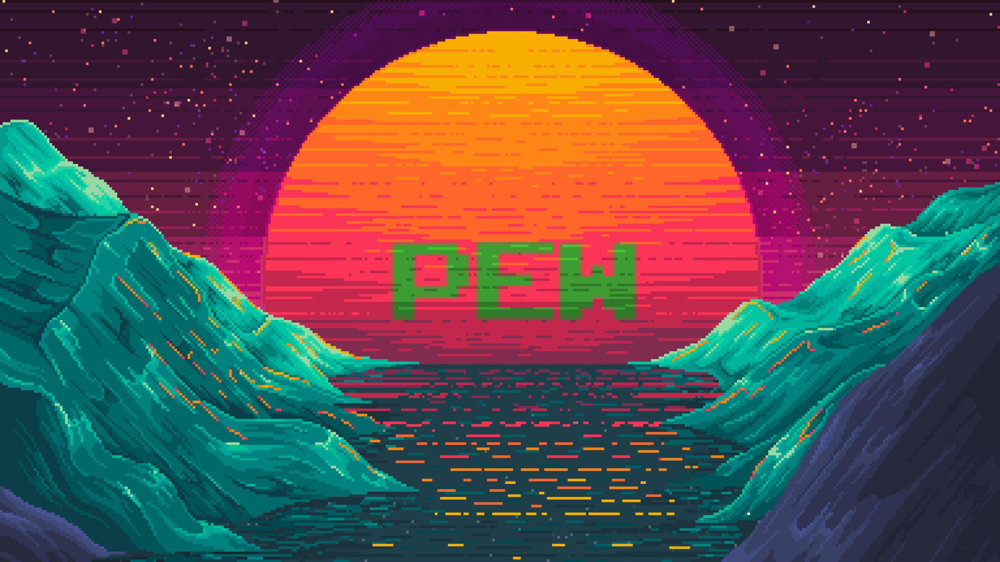

## 💜 Ello! My name is <strong>PewDizinho!</strong> But you can call me just <strong>Pew</strong>!

> I'm currently working with some minecraft projects with JavaScript, a Discord Bot with NodeJs and some mobile apps with Dart/Flutter!
> 
> And taking Analysis and Systems Development classes in [Tuiti](https://tuiuti.edu.br/)
> 
> 💬 If you want to get in touch, contact me on discord [PewDizinho#3014](https://cnpcscripts.com/pew) or on twitter [@PewDizinho_](https://twitter.com/PewDizinho_)! You can also look more about me in my [website](https://pewdizinho.github.io/).

## 🚀 My Skills

 

## ⭐ Information about my GitHub account

<a href="https://github.com/PewDizinho">
 

 

 

 
 
Wanna support me? Buy me a Coffee!
 

